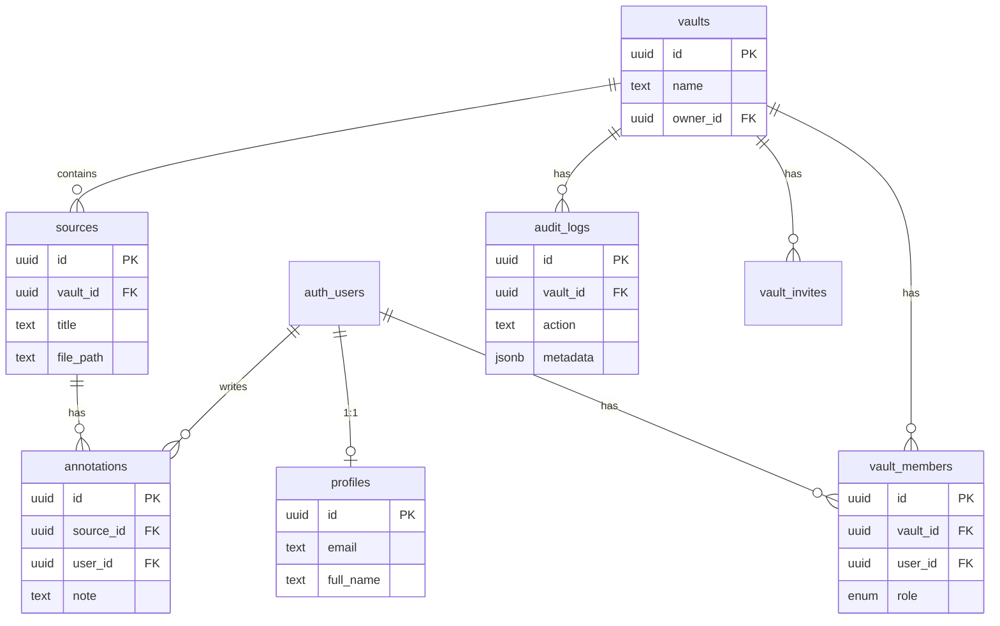

# SynScript

**Collaborative Research & Citation Engine.** Build Knowledge Vaults with verified sources, annotated PDFs, and cross-referenced citations. Think Google Docs for research: real-time sync, role-based access, and full auditability.

---

## Tech Stack

| Layer | Choice |
|-------|--------|
| Framework | Next.js 14 (App Router) |
| Database | Supabase (PostgreSQL) |
| Auth | Supabase Auth (JWT, session in cookies) |
| Real-time | Supabase Realtime |
| Storage | Supabase Storage (private bucket, signed URLs) |
| UI | Tailwind CSS, shadcn/ui |
| Rate limiting | Upstash Redis (sliding window) |
| Hosting | Vercel |

---

## System Architecture

- **Frontend**: Next.js App Router; server components for data, client components for forms and real-time subscriptions.
- **Backend**: Server Actions for mutations (vaults, sources, annotations, members, uploads); API routes for health and audit export.
- **Database**: PostgreSQL via Supabase with Row-Level Security (RLS). No table is readable/writable without RLS policies.
- **Auth**: Supabase Auth handles signup/login/logout; session persists in HTTP-only cookies; middleware refreshes session and applies rate limiting.
- **Real-time**: Supabase Realtime (postgres_changes) on `sources`, `vault_members`, and `annotations` so changes appear without refresh.
- **Files**: Stored in a private Supabase Storage bucket; vault members get time-limited signed URLs for PDFs.

---

## Database Schema

### Tables

- **profiles** — Linked to `auth.users`. One row per user (id, email, full_name, avatar_url). Created automatically on signup via trigger.
- **vaults** — Research repositories (id, name, description, owner_id, created_at, updated_at).
- **vault_members** — Many-to-many: user ↔ vault with **role** (owner | contributor | viewer). Unique on (vault_id, user_id); no duplicate members.
- **sources** — Items in a vault (id, vault_id, title, url, file_path, created_at, updated_at).
- **annotations** — Notes on a source (id, source_id, user_id, note, page_number, rect, created_at).
- **audit_logs** — Append-only (id, vault_id, user_id, action, metadata, created_at). No update/delete policies.
- **vault_invites** — Pending invites by email (vault_id, email, role).

### ER Diagram

### Foreign Keys & Indexes

- All FKs set; **ON DELETE CASCADE** on vault → members, invites, sources, audit_logs; source → annotations; profile → auth.users.
- Indexes: `vault_members(vault_id)`, `vault_members(user_id)`, `sources(vault_id)`, `annotations(source_id)`, `annotations(user_id)`, `audit_logs(vault_id)`, `audit_logs(created_at DESC)`.

---

## Role-Based Access Control (RBAC)

| Role | Vault | Members | Sources | Annotations | Audit |
|------|--------|---------|---------|-------------|-------|
| **Owner** | Create, read, update, delete | Add, remove, change role | Full CRUD | Full CRUD | Read, export |
| **Contributor** | Read | — | Add, edit, delete (own vault) | Add, edit/delete own | Read, export |
| **Viewer** | Read | — | Read | Read | Read, export |

- **RLS**: Enabled on `profiles`, `vaults`, `vault_members`, `sources`, `annotations`, `vault_invites`, `audit_logs`.
- Only **Owner** can delete the vault, add/remove members, or change roles.
- **Contributors** can add/edit/delete sources and add/edit/delete their own annotations.
- **Viewers** are read-only; edit/delete buttons are hidden in the UI (not just disabled).
- **Security test**: Log in as User A, open a vault URL that belongs only to User B → you get redirected to `/vaults` or 404; no data is returned (RLS blocks rows).

---

## Rate Limiting

- **Implemented**: Upstash Redis sliding window (e.g. 60 requests per minute per IP) in `middleware.ts`. Returns `429 Too Many Requests` when exceeded.
- If Redis env vars are missing, rate limiting is skipped (see README Quick Start). For production, set `UPSTASH_REDIS_REST_URL` and `UPSTASH_REDIS_REST_TOKEN`.

## Caching (Redis)

- **Vault role cache**: `getVaultRole()` uses Redis (when configured) to cache vault membership for 5 minutes, reducing DB load for high-traffic vaults. Cache is invalidated when a member is added, removed, or their role is changed.
- Optional future: cache vault list or recent sources with short TTL and invalidation on write.

## Notifications

- **In-app**: Toasts when a new collaborator is added, role is changed, or a collaborator is removed (Supabase Realtime).
- **Browser**: When a new contributor is added to a vault, the Web Notifications API is used (with permission) so users see a native browser notification even if the tab is in the background.
- **Optional (SRS)**: For scale, a managed service (Pusher, Twilio, or Firebase Cloud Messaging) can be added for push/SMS notifications; current implementation uses browser Notifications + in-app toasts.

---

## Auditability

- Every major action writes an **audit log**: vault created/updated/deleted, source added/updated/deleted, member added/removed/role changed, file uploaded.
- Audit logs are **append-only** (no update/delete policies).
- **Visible**: Vault page has an "Audit logs" link; dedicated page lists logs and offers **Export CSV** (`GET /api/vaults/[id]/audit-logs?format=csv`).

---

## Real-Time Sync

- **Sources**: New/updated/deleted sources in a vault appear without refresh (Supabase Realtime on `sources`).
- **Members**: Add/remove/role change → UI updates and toast.
- **Annotations**: On the PDF viewer, new/updated/deleted annotations for that source appear without refresh (Realtime on `annotations`).

**How to test**: Open the same vault in two browsers (or tabs with different users). Add a source in one → it appears in the other. Same for annotations and contributors.

---

## Storage (File Upload)

- PDFs upload to Supabase Storage bucket **pdfs** (private).
- Only authenticated users can upload; only **owner/contributor** can upload to a vault.
- **Signed URLs** used for reading; TTL 1 hour. Max file size **10MB**; type validated (PDF).
- When a source is deleted, its file is removed from storage.

---

## Scaling Notes

- **Database**: Indexes on FKs and filters; avoid N+1 (batch signed URLs, etc.). For very large lists, add pagination (e.g. sources/vaults).
- **Rate limiting**: Prevents API spam; tune limits per environment.
- **Realtime**: Supabase manages connections; for very high concurrency, consider connection limits and batching.
- **Caching**: Redis is used for rate limiting; optional future: cache vault list or permissions per user with short TTL and invalidation on write.

---

## Quick Start

1. **Install**: `npm install`
2. **Env**: Copy `.env.example` to `.env.local` and set:
   - `NEXT_PUBLIC_SUPABASE_URL`, `NEXT_PUBLIC_SUPABASE_ANON_KEY`
   - `SUPABASE_SERVICE_ROLE_KEY` (server-only)
   - `UPSTASH_REDIS_REST_URL`, `UPSTASH_REDIS_REST_TOKEN` (optional; rate limiting off if missing)
3. **DB**: Run `lib/db/schema.sql` in Supabase SQL Editor; then run `supabase/migrations/*.sql` and `supabase/realtime-enable.sql` (and `supabase/migrations/20240215_realtime_annotations.sql`).
4. **Storage**: Create bucket `pdfs` (private); add policies as in schema comments.
5. **Run**: `npm run dev`

---

## Deployment (Vercel)

- Build and deploy to Vercel; set env vars in project settings (no `.env` in repo).
- In Supabase Dashboard → Authentication → URL Configuration, add your production site URL and redirect URLs (e.g. `https://your-app.vercel.app/**`).
- Ensure `GET /api/health` returns 200 for health checks.
- **Screenshots**: Add 2–3 screenshots to the README (dashboard, vault with sources, PDF with annotations) for a quick visual overview.

---

## API Surface

| Area | Action / Route | Description |
|------|----------------|-------------|
| Auth | Supabase Auth | signUp, signInWithPassword, signOut |
| Vaults | Server Actions | createVault, updateVault, deleteVault |
| Members | Server Actions | inviteMember, updateMemberRole, removeMember |
| Sources | Server Actions | addSource, updateSource, deleteSource, deleteSourcesBulk |
| Annotations | Server Actions | addAnnotation, updateAnnotation, deleteAnnotation |
| Upload | uploadPdf | PDF, max 10MB, audit logged |
| Audit | `GET /api/vaults/[id]/audit-logs` | JSON list; `?format=csv` for export |
| Health | `GET /api/health` | `{ status: 'ok' }` |

---

## Assumptions & Limits

- Max upload **10MB**; type **PDF** (see `app/actions/upload.ts`).
- Rate limit: **60 req/min per IP** when Redis is set.
- Signed URL TTL: **1 hour**.

---

## Testing

- `npm run lint`
- **Manual**: Sign up → create vault → add source → upload PDF → add annotation → invite member; open vault in two tabs and confirm real-time updates.

---

## Known Limitations

- Search is client-side or Supabase `ilike` (no Elasticsearch).
- Push/SMS via Pusher or Twilio is not integrated; browser Notifications API + in-app toasts cover the SRS “browser notifications when new Contributor added” requirement.
- Tags/Topics and Authors on sources (many-to-many) are optional and not in the current schema.
- Multipart upload for very large files (>10MB) is not implemented; single-request upload with 10MB limit.
